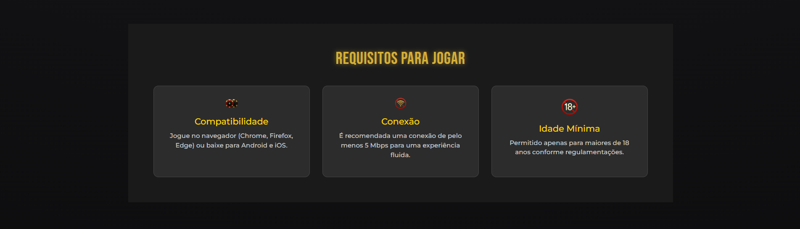

# 🎰 Império das Fichas


> 💬 “Onde o luxo encontra a sorte e as fichas fazem história.”

Bem-vindo ao **Império das Fichas**, a experiência digital definitiva para amantes de cassino! Esta landing page foi cuidadosamente projetada para apresentar de forma luxuosa, acessível e responsiva um jogo feito em Java, trazendo ao público a emoção dos grandes cassinos diretamente para a web.


---

## 👑 Sobre o Projeto

A página do Império das Fichas é uma **landing page promocional** construída com **HTML5** e **CSS3**, com suporte ao **Bootstrap 5** e animações visuais. Ela visa:

- 🧲 Atrair e impressionar novos jogadores.
- 🎮 Apresentar os principais recursos e jogos com estilo.
- 📲 Garantir uma experiência otimizada em qualquer dispositivo.
- ♿️ Assegurar acessibilidade total com uso de HTML semântico e contraste ideal.

---

## 🎯 Objetivos

### 🎯 Objetivo Geral
Promover o jogo central desenvolvido em Java, criando uma primeira impressão impactante que converta visitantes em jogadores ativos.

### 🎯 Objetivos Específicos

- ✅ Apresentar o jogo de forma atrativa com identidade visual temática.
- ✅ Informar detalhes sobre jogabilidade, prêmios e requisitos.
- ✅ Guiar o usuário para ação com CTAs estratégicos.
- ✅ Garantir acessibilidade, responsividade e usabilidade.
- ✅ Oferecer desempenho rápido e carregamento eficiente.

---

## 🛠️ Tecnologias Utilizadas

| Tecnologia   | Função |
|--------------|--------|
| `HTML5`      | Estrutura semântica e acessível |
| `CSS3`       | Estilização luxuosa e responsiva |
| `Bootstrap 5`| Componentes de layout e interatividade |
| `Lightbox 2` | Visualização da galeria (versão alternativa) |
| `FontAwesome`| Ícones visuais e acessíveis |
| `Google Fonts`| Fontes Bebas Neue e Montserrat |

---

## 🧩 Funcionalidades Completas

| Código | Funcionalidade              | Descrição                                                                 |
|--------|-----------------------------|---------------------------------------------------------------------------|
| F01    | Cabeçalho                   | Inclui logo/título do jogo e menu de navegação com scroll suave.         |
| F02    | Seção Principal (Hero)      | Título, subtítulo, CTA estilizada e imagem/vídeo de fundo.               |
| F03    | Sobre o Jogo                | Descrição, arte conceitual e diferenciais do jogo.                        |
| F04    | Recursos                    | Destaques com ícones e textos sobre segurança, suporte e pagamentos.     |
| F05    | Galeria/Mídia               | Grade de imagens com visualização em modal interativo.                   |
| F06    | Requisitos do Sistema       | Informações de compatibilidade, conexão e idade mínima.                  |
| F07    | Cadastro                    | Formulário acessível com campos validados e design intuitivo.            |
| F08    | FAQ                         | Perguntas Frequentes em acordeão estilizado.                             |
| F09    | Rodapé                      | Informações institucionais, redes sociais e links úteis.                 |
| F10    | Navegação Interna           | Rolagem suave para seções específicas da mesma página.                   |
| F11    | Botões CTA Clicáveis        | Todos os botões interativos levam a ações ou seções relacionadas.        |
| F12    | Formulário Acessível        | Input de nome, e-mail, telefone e fonte de indicação com padrão acessível. |
| F13    | Exibição de Mídia           | Todas as imagens carregam corretamente e são responsivas.                |

## 📋 Requisitos Não-Funcionais Detalhados

| Código | Requisito                          | Descrição                                                                 |
|--------|------------------------------------|---------------------------------------------------------------------------|
| NF01   | Performance                        | Carregamento rápido idealmente < 2 segundos.                             |
| NF02   | Usabilidade - Intuitividade        | Layout limpo e de fácil navegação.                                       |
| NF03   | Usabilidade - Feedback Visual      | Hover e foco bem definidos em elementos interativos.                     |
| NF04   | Responsividade - Design Adaptativo | Adaptação fluida a desktops, tablets e celulares.                        |
| NF05   | Responsividade - Media Queries     | Uso de media queries para estilos adaptáveis.                            |
| NF06   | Responsividade - Imagens Flexíveis | Imagens com max-width e height auto.                                     |
| NF07   | Responsividade - Tipografia Fluida | Fontes que se adaptam ao tamanho da tela.                                |
| NF08   | Acessibilidade - HTML Semântico    | Uso de tags semânticas como `<header>`, `<section>`, `<nav>`, etc.            |
| NF09   | Acessibilidade - Alt Text          | Todas as imagens com atributo alt descritivo.                            |
| NF010  | Acessibilidade - Contraste         | Contraste mínimo 4.5:1 para legibilidade.                                |
| NF011  | Acessibilidade - Foco Visível      | Destaque de foco para navegação via teclado.                             |
| NF012  | Acessibilidade - Ordem Tabulação   | Ordem lógica ao navegar por tabulação.                                   |
| NF013  | Acessibilidade - Idioma da Página  | Atributo `lang="pt-br"` definido no HTML.                                |
| NF014  | Acessibilidade - Hierarquia Hn     | Uso coerente de `<h1>` até `<h6>` na estrutura dos conteúdos.                |
| NF015  | Acessibilidade - Legibilidade      | Fontes claras, tamanho adequado e boa leitura.                           |
| NF016  | Compatibilidade entre Navegadores  | Funciona corretamente no Chrome, Firefox, Safari e Edge.                 |
| NF017  | Manutenibilidade - Código Limpo    | Código organizado, indentado e comentado.                                |
| NF018  | Manutenibilidade - Nomeação Clara  | Convenções consistentes para classes e IDs CSS.                          |

## 💻 Como Rodar Localmente

```bash
# Clone o repositório
git clone https://github.com/KaioPinto/imperio-das-fichas.git

# Acesse a pasta
cd imperio-das-fichas

# Abra o index.html no navegador
```

> 💡 Ou use a extensão **Live Server** no VSCode para uma experiência interativa.

---

## 📸 Demonstração

<p align="center">
  <br/>
  <br/>
  
</p>

---

## 👥 Equipe

| 👤 Nome              | 🛠️ Função         |
|----------------------|-------------------|
| **Kaio Moreira**     | Tech Lead         |
| **Gabriela Anjos**   | Desenvolvedora    |
| **Gabriel Ortiz**    | Desenvolvedor     |
| **Fernando Antonio** | Desenvolvedor     |
| **Silvia Cristina**  | Desenvolvedora    |

---

## 📃 Licença

Este projeto é de uso acadêmico e sem fins lucrativos. Todos os direitos das imagens e nomes utilizados são fictícios e voltados apenas para fins de aprendizado.

---

## 🃏 Considerações Finais

> “Onde o luxo encontra a sorte.”

Acesse, interaja e sinta-se em um verdadeiro império de fichas!

---

<p align="center">
  Desenvolvido com 💖 por <strong>Gabriela Anjos, Gabriel Ortiz, Fernando Antonio, Silvia Cristina</strong><br/>
  Orientado por <strong>Kaio Moreira</strong> — 2025
</p>